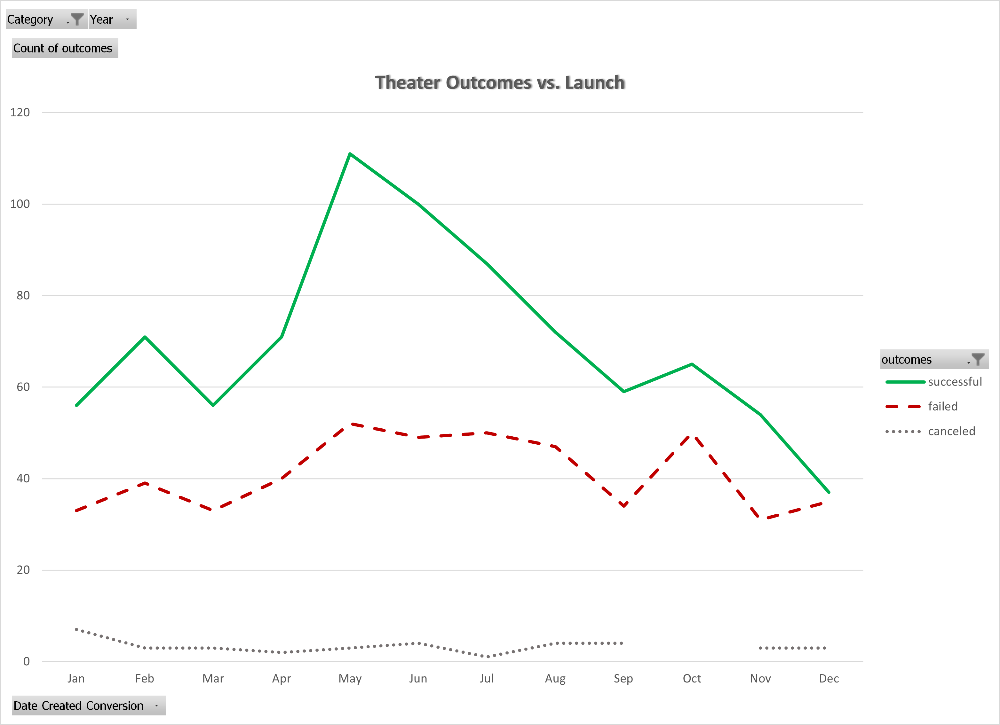
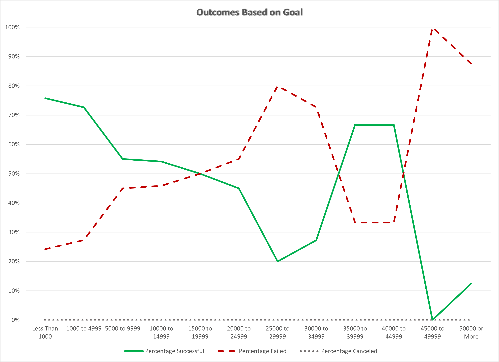

# Kickstarting with Excel

## Overview of Project

Louise’s play *Fever* came close to its fundraising goal in a short amount of time.  The client has requested an analysis on Kickstarter data to uncover trends for how different Kickstarter campaigns fared in relation to their launch dates and their funding goals.

### Purpose
The purpose of this analysis is to analyze how different Kickstarter campaigns fared in relation to their launch dates and their funding goals, focusing on theater campaigns.

## Analysis and Challenges

### Analysis of Outcomes Based on Launch Date
From the raw Kickstarter data, the "launch_at" date was converted from Unix timestamps to Gregorian calendar dates, and the "Category and Subcategory" field was parsed into two columns.  A pivot table was generated of campaign outcomes by launch month, excluding currently active (i.e. "live") Kickstarter campaigns.  Results were filtered to only include campaigns in the Theater category (totaling 1369 campains). The chart "Theater Outcomes vs. Launch Date" below graphically illustrates this data, for all countries and all years (17 May 2009 to 15 Mar 2017).

The pivot table and data associated with this chart are available in the **"Theater Outcomes by Launch Date" worksheet** in the Excel file:
[Kickstarter_Challenge.xlsx](Kickstarter_Challenge.xlsx)

### Analysis of Outcomes Based on Goals
Continuing the analysis of outcomes, the percentage of successful, failed, and canceled plays was calculated based on the funding goal amount.  Again, currently active (i.e. "live") Kickstarter campaigns were excluded.  The data set was further limited to exclude the two non-play subcategories ("musicals" and "spaces") in the Theater category. This leaves 1047 campaigns for assessment.  Funding goals were group into twelve ranges, from "Less than $1000" to "$50000 or more".  The **COUNTIFS** function in Excel was used to determine the number of campaigns in each range that met the criteria.  The chart "Outcomes Based on Goal" below graphically illustrates this data, for all countries.

The calculations and data associated with this chart are available in the **"Outcomes Based on Goals" worksheet** in the Excel file:
[Kickstarter_Challenge.xlsx](Kickstarter_Challenge.xlsx)

### Challenges and Difficulties Encountered
One challenge was checking the results of the analysis, particularly with the Outcomes Based on Goals.  Initially, one of the **COUNTIFS** criteria was erroneously entered as merely ">" instead of the correct ">=".  Fortunately, checking the sum of the "Number Successful" column against a count of all successful plays revealed the error.

## Results

Analyzing by launch date, Kickstarter Theater campaigns appear to be more successful when launched in late spring and the start of summer.  The number of failed campaigns seems to be fairly consistent throughout the year.  

When looking at the outcomes vs. funding goals, plays with lower funding goals are more likely to be successful.  While there is a a spike in the percent successful campaigns for $35k to $45k goals, campaigns in this range only represent 9 of 1047 campaigns, which likely skews the percentage to appear more positive than may be warranted.

One key limitation is that the data doesn't quantify or track any other potential external factors, such as marketing, number of shares via email or social media, or celebrity endorsement.  Regionality might also have significant impact, which hasn't been addressed in this analysis.  In addition, this analysis does not interrogate whether trends have changed across the years.

To address the impact of regionality, additional tables and graphs may be generated focused on various countries.  For changes in annual trends, a stacked bar graph of outcome vs. launch month may be informative, where the monthly bar stacks divided by years.
