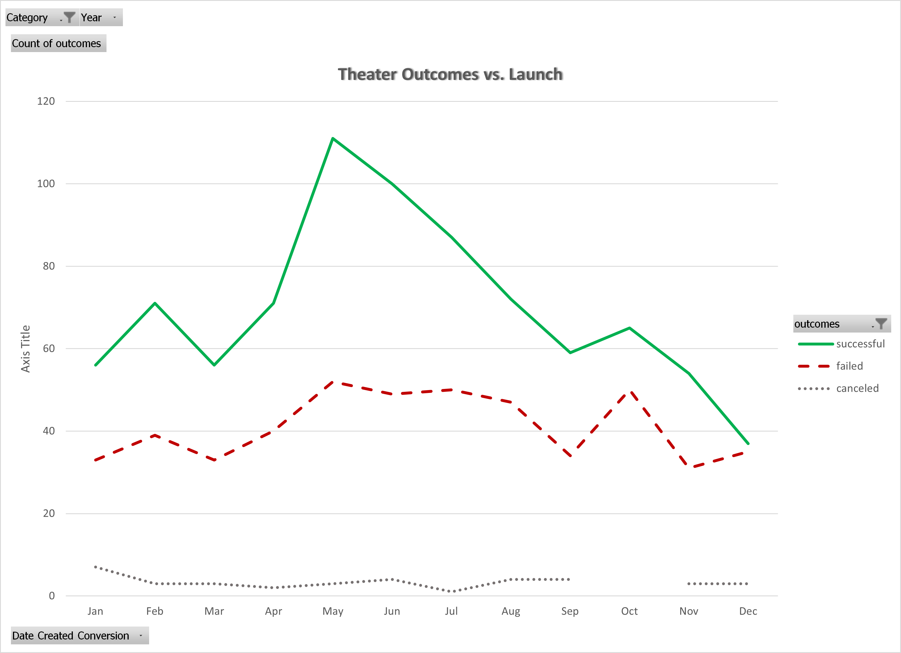
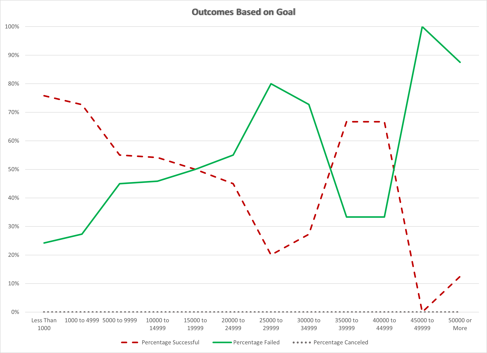

# Kickstarting with Excel

## Overview of Project

Louise’s play *Fever* came close to its fundraising goal in a short amount of time.  The client has requested an analysis on Kickstarter data to uncover trends for how different Kickstarter campaigns fared in relation to their launch dates and their funding goals.

### Purpose
The purpose of this analysis is to analyze how different Kickstarter campaigns fared in relation to their launch dates and their funding goals, focusing on theater campaigns.

## Analysis and Challenges

### Analysis of Outcomes Based on Launch Date
From the raw Kickstarter data, the "launch_at" date was converted from Unix timestamps to Gregorian calendar dates, and the "Category and Subcategory" field was parsed into two columns.  A pivot table was generated of campaign outcomes by launch month, excluding currently active (i.e. "live") Kickstarter campaigns.  Results were filtered to only include campaigns in the Theater category. The chart "Theater Outcomes vs. Launch Date" below graphically illustrates this data, for all years and all countries.

The pivot table and data associated with this chart are available in the **"Theater Outcomes by Launch Date" worksheet** in the Excel file:
[Kickstarter_Challenge.xlsx](Kickstarter_Challenge.xlsx)

### Analysis of Outcomes Based on Goals
Continuing the analysis of outcomes, the percentage of successful, failed, and canceled plays was calculated based on the funding goal amount.  Again, currently active (i.e. "live") Kickstarter campaigns were excluded.  The data set was further limited to exclude the two non-play subcategories ("musicals" and "spaces") in the Theater category. Funding goals were group into twelve ranges, from "Less than $1000" to "$50000 or more".  The chart "Outcomes Based on Goal" below graphically illustrates this data, for all countries.

The calculations and data associated with this chart are available in the **"Outcomes Based on Goals" worksheet** in the Excel file:
[Kickstarter_Challenge.xlsx](Kickstarter_Challenge.xlsx)

### Challenges and Difficulties Encountered

## Results

- What are two conclusions you can draw about the Outcomes based on Launch Date?

- What can you conclude about the Outcomes based on Goals?

- What are some limitations of this dataset?

- What are some other possible tables and/or graphs that we could create?
